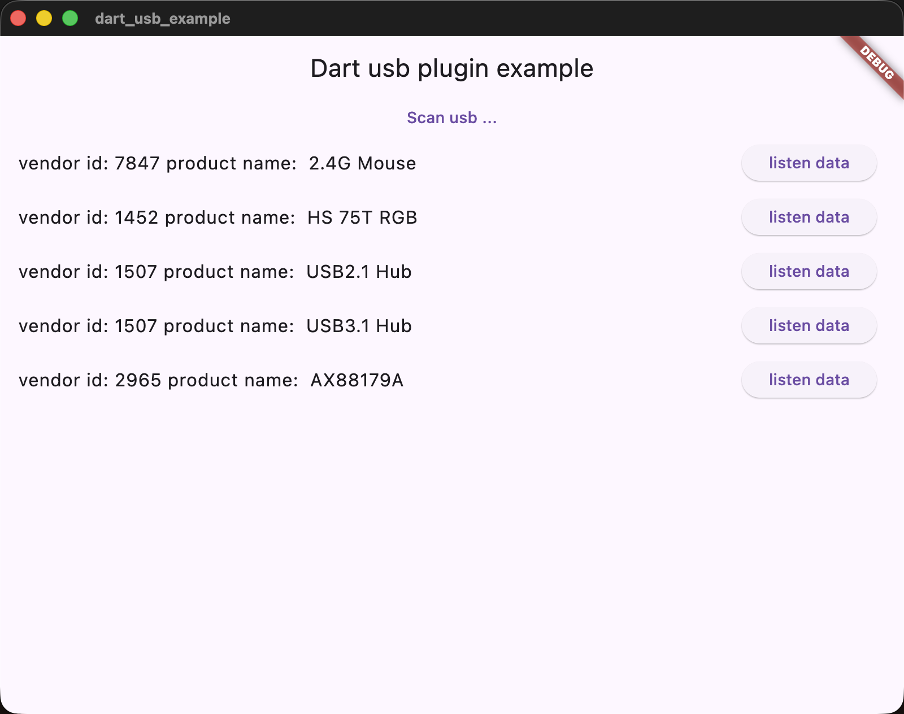
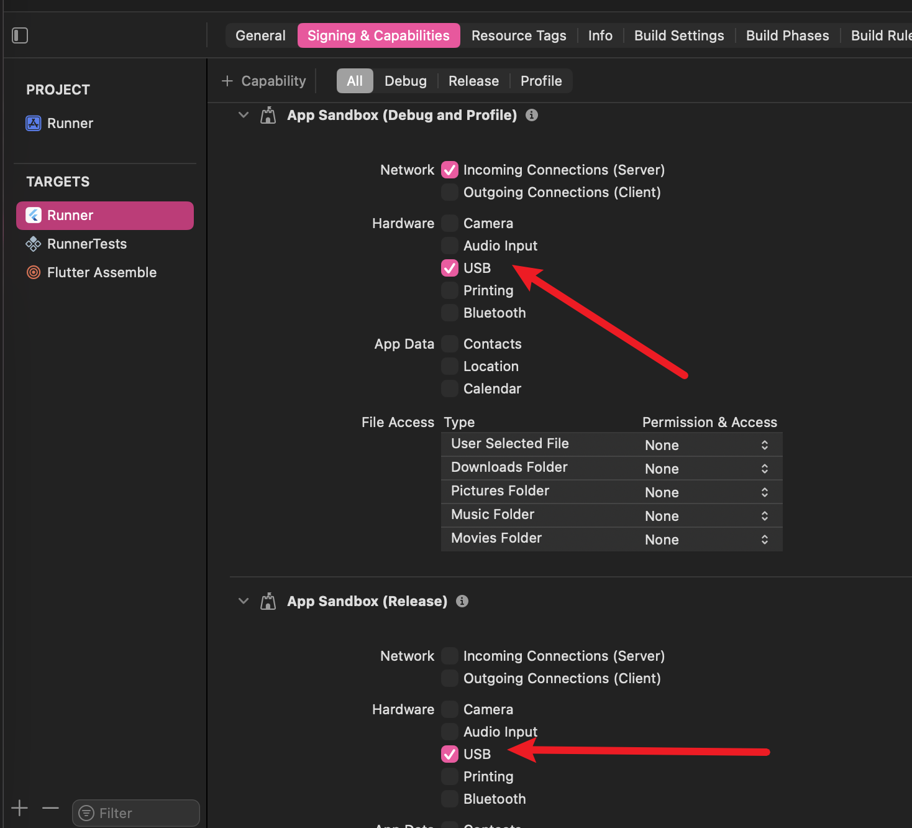
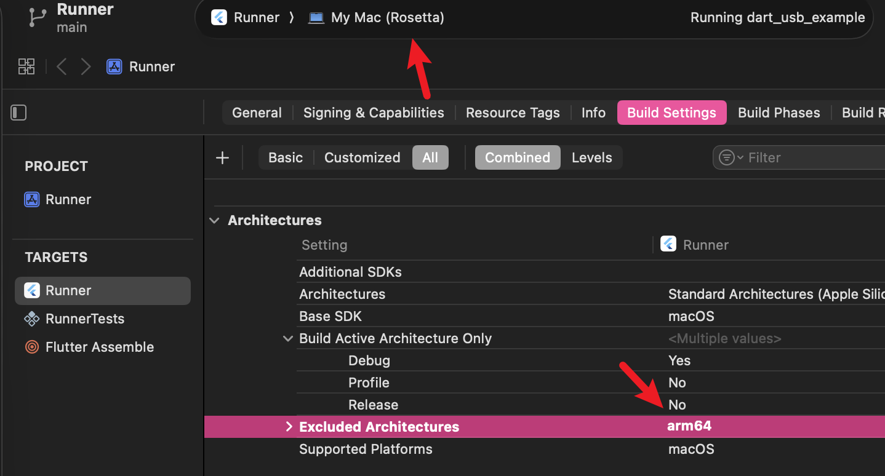

# dart_usb

dart library for obtaining USB interface information





## Getting Started

```yaml
dart_usb: any
```

## Initialization

Before using any API, you need to initialize the library.

```dart
import 'package:dart_usb/frb_generated.dart';

void main() async {
  await RustLib.init();
  // ... your code
}
```

## Api


#### Get USB Device List

```dart
import 'package:dart_usb/dart_usb.dart';

Future<void> getAndPrintUsbInfos() async {
  List<UsbInfo> usbList = await getUsbInfos();

  // Print device information
  for (var element in usbList) {
      print('Vendor ID: ${element.vendorId}, Product ID: ${element.productId}');
      print('Bus Number: ${element.busNumber}, Address: ${element.address}');
      print('USB Version: ${element.usbVersion.field0}.${element.usbVersion.field1}.${element.usbVersion.field2}');
      // More UsbInfo fields...
  }
}
```

#### Get USB Device Name

The `readUsbName()` method may fail, so error handling is recommended.

```dart
import 'package:dart_usb/dart_usb.dart';

Future<void> printName(UsbInfo usbInfo) async {
  try {
    final name = await usbInfo.readUsbName();
    print('Product Name: ${name.productName ?? "N/A"}');
    print('Manufacturer Name: ${name.manufacturerName ?? "N/A"}');
    print('Serial Number: ${name.serialNumber ?? "N/A"}');
  } catch (e) {
    print('Failed to read USB name: $e');
  }
}
```

#### Open USB Device and Write Data

The `open()` method may fail, so error handling is recommended.

```dart
import 'package:dart_usb/dart_usb.dart';

Future<void> writeData(UsbInfo info) async {
  try {
    UsbHandle handle = await info.open();
    // Claim interface (usually 0)
    handle.claimInterface(iface: 0);

    // Write data
    BigInt bytesWritten = await handle.writeData(
        endpoint: 3, buf: "hello world".codeUnits, timeout: BigInt.from(1000));
    print('Wrote $bytesWritten bytes');

    // Release interface
    handle.releaseInterface(iface: 0);
  } catch (e) {
    print('Failed to write data: $e');
  }
}
```

#### Read Data from USB Device (Interrupt Transfer)

```dart
import 'package:dart_usb/dart_usb.dart';
import 'dart:typed_data';

Future<void> readInterruptData(UsbInfo info) async {
  try {
    UsbHandle handle = await info.open();
    // Claim interface (usually 0)
    handle.claimInterface(iface: 0);

    // Read interrupt data, listen to the data stream
    handle.readInterrupt(endpoint: 1, timeout: BigInt.from(1000)).listen(
      (Uint8List data) {
        print('Received interrupt data: ${String.fromCharCodes(data)}');
      },
      onError: (e) {
        print('Error reading interrupt data: $e');
      },
      onDone: () {
        print('Interrupt data read complete');
      },
    );

    // Release interface (call when appropriate, e.g., when no longer needed to listen)
    // handle.releaseInterface(iface: 0);
  } catch (e) {
    print('Failed to open device or read interrupt data: $e');
  }
}
```

#### Listen for USB Hotplug Events

```dart
import 'package:dart_usb/dart_usb.dart';

void listenUsbEvents() {
  // Check USB device list every 500 milliseconds
  listenUsbEventHandle(sleep: BigInt.from(500)).listen(
    (event) {
      print('Currently connected USB devices: ${event.map((e) => e.productId).join(', ')}');
    },
    onError: (e) {
      print('Error listening for USB events: $e');
    },
  );
}
```

#### Other UsbHandle Methods

- `void claimInterface({required int iface})`: Claims a USB interface, usually called before data transfer.
- `void releaseInterface({required int iface})`: Releases a USB interface.
- `void setActiveConfiguration({required int config})`: Sets the active configuration of the device, usually 1.
- `Stream<Uint8List> readInterrupt({required int endpoint, required BigInt timeout})`: Reads data via interrupt transfer, returns a data stream.
- `BigInt writeData({required int endpoint, required List<int> buf, required BigInt timeout})`: Writes data via bulk transfer.


Macos 

> You need to open USB permission on macOS




> in m1 mac , you need exclude arm64 , and run in rosetta


